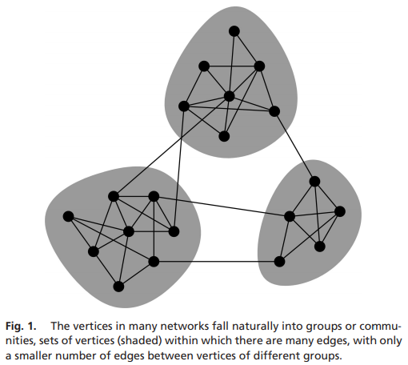

# Community Structure in Networks.

## :page_with_curl: Introduction
Implementation of algorithm for detecting community structures (or clusters) in a network using Newman's methods to maximize modularity (see reference below).

  

> **_Reference:_**
Newman, Mark EJ. "Modularity and community structure in networks." Proceedings of the national academy of sciences 103, no. 23 (2006): 8577-8582. [[Link]](https://www.pnas.org/content/103/23/8577.short)

 

## Input File
The algorithm receives a file representing the graph.
The first value represents the number of nodes in the network. 
The second represents the number of edges of the first node, i.e., k1. It is followed by the k1 indices of its neighbors, in increasing order. 
The next value is k2, followed by the k2 indices of the neighbors of the second node, and so on up to node n.

## Output File
The algorithm creates an output file describing the clusters within the graph.
The first value represents the number of groups in the division.
The second value represents the number of nodes in the first group, followed by the indices of the nodes in the group, in increasing order.
The next value is the number of nodes in the second group, followed by the indices of the nodes in group, then the number of nodes and indices of nodes in the third group, and so on until the last group.

## File Format
The input and output files are both binary files consisting *only* of integers.

## Execution Instructions:
The program receives two command-line arguments. The 1st is an input filename, and the 2nd is an output filename. The input of your program is a network (a graph), and the output is a list of groups (the division).

The program is compiled using the command: 

    make
Then, to run the program use the command: 

    ./cluster input_file.in output_file.out
This will create a new file named 'output_file.out' containing the output.

